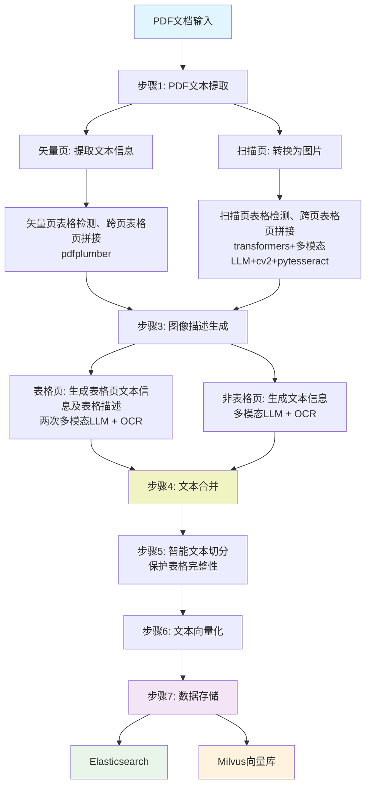

# RAG-REITsTextFlow

一个用于REITs公告PDF文档处理项目。

## 项目简介

本项目是一个专门用于处理基础设施公募REITs（Real Estate Investment Trusts）公告PDF文件清洗的完整数据处理管道。系统能够自动化地将PDF公告文档转换为结构化数据，能够检测表格、实现跨页表格拼接，并将表格内容还原为便于检索的文本信息。并构建向量数据库和 Elasticsearch ，实现本地知识库，以支持智能检索与问答系统。

## 🚀 主要功能

### 核心处理流程



#### 详细流程说明

1. **PDF文本提取** - 区分矢量页和扫描页，矢量页直接提取文本，扫描页转为图片处理
2. **表格检测与跨页合并** - 矢量页使用pdfplumber，扫描页综合运用transformers模型、多模态LLM、cv2、pytesseract等智能检测并拼接跨页表格
3. **图像描述生成** - 表格页通过多层级LLM+OCR生成表格详细描述及文本信息，非表格页使用多模态LLM+OCR提取文本
4. **文本合并** - 智能合并和替换，生成完整文档内容
5. **智能文本切分** - 保证表格内容完整性，避免切断表格结构
6. **文本向量化** - 生成高质量文本嵌入向量
7. **数据存储** - 同时支持Elasticsearch和Milvus向量数据库

### 🔥 技术特性

- **智能表格处理** - 综合运用transformers模型、多模态LLM、cv2、pytesseract等方法，自动检测表格、识别并拼接跨页表格

- **LLM增强描述** - 相较于传统表格信息提取，采用大语言模型生成表格内容的语义化描述，让表格数据更易于理解和检索

- **智能切分保护** - 文本分割时智能识别表格边界，确保表格内容不被破坏，保持数据完整性

- **多数据库支持** - 同时支持Elasticsearch全文检索和Milvus向量检索，提供多样化的查询能力

- **模块化设计** - 每个步骤独立运行，便于调试和维护，支持灵活的流程定制


## 📁 项目结构

```
rag_v2/
├── table-transformer-detection                    # table-transformer 模型
├── README.md                                      # 项目说明文档
├── .gitignore                                     # Git忽略文件配置
├── requirements.txt                               # Python依赖包列表
│
├── 配置文件
│   ├── db_config.py                               # 数据库配置(MySQL、Elasticsearch、Milvus)
│   ├── model_config.py                            # AI模型API配置(各厂商API密钥)
│   ├── file_paths_config.py                       # 文件路径配置
│   └── common_utils.py                            # 通用工具函数
│
├── 数据库创建脚本
│   ├── create_elasticsearch_index.py              # 创建Elasticsearch索引
│   └── create_vector_database.py                  # 创建Milvus向量数据库
│
├── 步骤1: PDF处理
│   └── step1_process_pdfs.py                      # PDF文档预处理,区分矢量页和扫描页
│
├── 步骤2: 文本提取
│   └── step2_extract_text_onlyvactor_multi_process.py  # 矢量页文本提取(多进程)
│
├── 步骤3: 表格检测与跨页合并
│   ├── step3_cross_page_table_detector.py         # 跨页表格检测器(基础版)
│   ├── step3_1_detection_vactor_multi_process.py  # 矢量页表格检测(多进程)
│   └── step3_2_table_detection_scan_multifile.py  # 扫描页表格检测(多文件处理)
│
├── 步骤4: 图像描述生成
│   ├── step4_compress_image.py                    # 图像压缩工具
│   ├── step4_1_1_describe_table_images_multi_thread.py      # 表格图像描述生成(第一轮,多线程)
│   ├── step4_1_2_describe_table_images_multi_thread_second.py  # 表格图像描述生成(第二轮,多线程)
│   ├── step4_2_1_describe_not_table_images_llm.py # 非表格图像描述生成(LLM)
│   ├── step4_2_2_describe_not_table_images_llm_second.py  # 非表格图像描述生成(第二轮)
│   ├── step4_describe_not_table_images_PaddleOCR.py  # 非表格图像OCR识别(PaddleOCR)
│   ├── step4_table_utils.py                       # 表格处理工具(单线程)
│   ├── step4_table_utils_ali.py                   # 表格处理工具(阿里云API)
│   ├── step4_table_utils_ali_multi_thread.py      # 表格处理工具(阿里云API,多线程)
│   └── step4_table_utils_multi_thresd.py          # 表格处理工具(多线程)
│
├── 步骤5: 文本合并
│   └── step5_merge_table_into_text.py             # 合并表格描述到正文
│
├── 步骤6: 文本分割
│   └── step6_text_segmentation.py                 # 智能文本切分(保护表格完整性)
│
├── 步骤7: 文本向量化
│   └── step7_text_embedding.py                    # 生成文本嵌入向量
│
└── 步骤8: 数据存储
    ├── step8_1_ingest_elasticsearch_data.py       # 导入数据到Elasticsearch
    └── step8_2_ingest_vector_database.py          # 导入数据到Milvus向量库
```

## ⚙️ 安装与配置

### 1. 环境要求

- Python 3.8+
- MySQL 5.7+
- Elasticsearch 7.x+
- Milvus 2.x+
- 足够的磁盘空间用于存储PDF文件和生成的数据

### 2. 安装依赖

```bash
pip install -r requirements.txt
```

### 3. 配置数据库

编辑 `db_config.py` 文件,配置您的数据库连接信息:
- MySQL数据库密码
- Elasticsearch密码
- Milvus向量数据库密码

### 4. 配置API密钥

编辑 `model_config.py` 文件,配置您的AI模型API密钥:
- DeepSeek API密钥
- 智谱AI API密钥
- 阿里云通义千问API密钥


### 5. 配置文件路径

编辑 `file_paths_config.py` 文件,设置PDF输入路径和输出路径。

## 🚀 使用方法

### 完整流程运行

按顺序执行以下脚本:

```bash
# 步骤1: 处理PDF
python step1_process_pdfs.py

# 步骤2: 提取文本
python step2_extract_text_onlyvactor_multi_process.py

# 步骤3: 检测表格
python step3_1_detection_vactor_multi_process.py
python step3_2_table_detection_scan_multifile.py

# 步骤4: 生成图像描述
python step4_1_1_describe_table_images_multi_thread.py
python step4_1_2_describe_table_images_multi_thread_second.py
python step4_2_1_describe_not_table_images_llm.py
python step4_2_2_describe_not_table_images_llm_second.py

# 步骤5: 合并文本
python step5_merge_table_into_text.py

# 步骤6: 文本分割
python step6_text_segmentation.py

# 步骤7: 生成向量
python step7_text_embedding.py

# 步骤8: 存储数据
python step8_1_ingest_elasticsearch_data.py
python step8_2_ingest_vector_database.py
```

## 📧 联系方式

如有问题或建议,请联系: 412447958@qq.com

