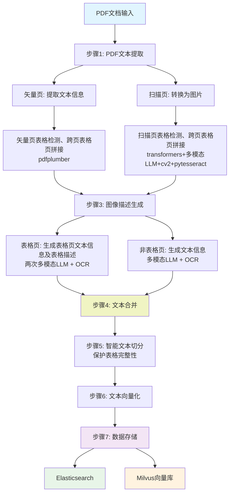

# RAG-REITsTextFlow

一个用于REITs公告PDF文档处理项目。

## 项目简介

本项目是一个专门用于处理基础设施公募REITs（Real Estate Investment Trusts）公告PDF文件的完整RAG数据处理管道。系统能够自动化地将PDF公告文档转换为结构化数据，能够检测表格、实现跨页表格拼接，并将表格内容还原为便于检索的文本信息。并构建向量数据库和 Elasticsearch 以支持智能检索与问答系统。

## 🚀 主要功能

### 核心处理流程


```mermaid
graph TD
    A[PDF文档输入] --> B[步骤1: PDF文本提取]
    B --> B1[矢量页: 提取文本信息]
    B --> B2[扫描页: 转换为图片]
    
    B1 --> C1[矢量页表格检测、跨页表格页拼接<br/>pdfplumber]
    B2 --> C2[扫描页表格检测、跨页表格页拼接<br/>transformers+多模态LLM+cv2+pytesseract]
    
    C1 --> D[步骤3: 图像描述生成]
    C2 --> D
    D --> D1[表格页: 生成表格页文本信息及表格描述<br/>两次多模态LLM + OCR]
    D --> D2[非表格页: 生成文本信息<br/>多模态LLM + OCR]
    
    D1 --> E[步骤4: 文本合并]
    D2 --> E
    E --> F[步骤5: 智能文本切分<br/>保护表格完整性]
    F --> G[步骤6: 文本向量化]
    G --> H[步骤7: 数据存储]
    H --> I[Elasticsearch]
    H --> J[Milvus向量库]
    
    style A fill:#e1f5fe
    style E fill:#f0f4c3
    style H fill:#f3e5f5
    style I fill:#e8f5e8
    style J fill:#fff3e0
```

#### 详细流程说明

1. **PDF文本提取** - 区分矢量页和扫描页，矢量页直接提取文本，扫描页转为图片处理
2. **表格检测与跨页合并** - 矢量页使用pdfplumber，扫描页综合运用transformers模型、多模态LLM、cv2、pytesseract等智能检测并拼接跨页表格
3. **图像描述生成** - 表格页通过多层级LLM+OCR生成表格详细描述及文本信息，非表格页使用多模态LLM+OCR提取文本
4. **文本合并** - 智能合并和替换，生成完整文档内容
5. **智能文本切分** - 保证表格内容完整性，避免切断表格结构
6. **文本向量化** - 生成高质量文本嵌入向量
7. **数据存储** - 同时支持Elasticsearch和Milvus向量数据库

### 🔥 技术特性

- **智能表格处理** - 综合运用transformers模型、多模态LLM、cv2、pytesseract等方法，自动检测表格、识别并拼接跨页表格

- **LLM增强描述** - 相较于传统表格信息提取，采用大语言模型生成表格内容的语义化描述，让表格数据更易于理解和检索

- **智能切分保护** - 文本分割时智能识别表格边界，确保表格内容不被破坏，保持数据完整性

- **多数据库支持** - 同时支持Elasticsearch全文检索和Milvus向量检索，提供多样化的查询能力

- **模块化设计** - 每个步骤独立运行，便于调试和维护，支持灵活的流程定制


## 🚀 使用方法

### 运行完整流程
```bash
python run_all_announcement_scripts.py
```

### 分步骤运行
```bash
# 步骤1：处理PDF文件
python scripts/step1_process_pdfs.py

# 步骤2：提取文本
python scripts/step2_extract_text_onlyvactor_multi_process.py

# 其他步骤按需运行...
```

## 📁 项目结构

```
RAG-REITsTextFlow/
├── README.md                           # 项目说明文档
├── requirements.txt                    # Python依赖包
├── .env.example                        # 环境变量模板
├── .gitignore                          # Git忽略文件
├── run_all_announcement_scripts.py    # 主控制脚本
├── common_utils.py                     # 通用工具函数
├── db_config.py                        # 数据库配置
├── file_paths_config.py               # 文件路径配置
├── model_config.py                     # AI模型配置
├── 脚本说明.txt                        # 脚本功能说明
└── scripts/                           # 处理脚本文件夹
    ├── step1_process_pdfs.py           # PDF文件处理
    ├── step2_extract_text_onlyvactor_multi_process.py  # 文本提取
    ├── step3_1_detection_vactor_multi_process.py       # 矢量页表格检测
    ├── step3_2_table_detection_scan_multifile.py       # 扫描页表格检测
    ├── step4_*.py                      # 表格描述相关脚本
    ├── step5_merge_table_into_text.py  # 表格文本合并
    ├── step6_text_segmentation.py     # 文本分割
    ├── step7_text_embedding.py        # 文本向量化
    ├── step8_*.py                      # 数据库存储脚本
    └── 其他工具脚本...
```
联系方式：412447958@qq.com

